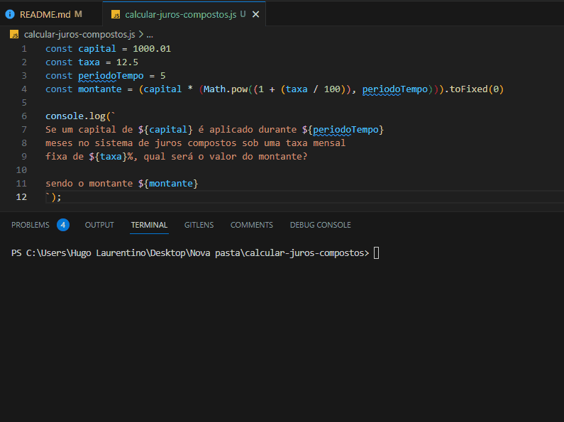

<h1 align="center">
  
</h1>

### Calcular juros compostos

- [x] Bak-End
- [x] Criar Título
- [x] Criar Descrição
- [x] Sobre
- [x] Tecnologia
- [x] Pre requisito
- [x] Autor
- [x] GIF‘s
---
<h1 align='center'>Calcular juros compostos</h1>

<p align='center'>Esse é um exemplo de logica em javascript</p>

<p align='center'>
	<a href='#sobre'>Sobre</a> |
	<a href='#pré-requisitos'>Pre Requisitos</a> |
	<a href='#tecnologias'>Tecnologias</a> |
	<a href='#autor'>Autor</a>
</p>

---
<h1 align='center'>
	
</h1>

---
### Sobre
  <p align= 'justify'>
    Para calcular os juros compostos, utiliza-se a expressão:
  </p>

$$ M = C(1 + i)^t $$

Onde,

**M:** montante (o capital acrescido dos juros, ou seja, Capital + Juros) \
**C:** capital (valor inicial de uma dívida, empréstimo ou investimento) \
**i:** taxa fixa de juros (expressa em decimal na fórmula, ou seja, o valor da taxa dividido por 100) \
**t:** período de tempo

---
### Pré-requisitos 

Antes de começar, você vai precisar ter instalado em sua máquina as seguintes FERRAMENTAS: [GIT](https://git-scm.com/), [Node.js](https://nodejs.org/en/download). 
Além disto é bom ter um editor para trabalhar com o código como [VSCode](https://code.visualstudio.com/download).

### 🎲 Rodando o Back End

```bash
# Clone este repositório
$ git clone https://github.com/hugolaurentino/calcular-juros-compostos.git

# Acesse a pasta do projeto no terminal/cmd
$ cd calcular-juros-compostos

# Instale as dependências
$ npm install

# Execute 
$ node .\calcular-juros-compostos.js

```
### Tecnologias 

As seguintes ferramentas foram usadas na construção do projeto:

- [Node.js][nodejs]
---

## Autor

Feito com ❤️ por Hugo Laurentino 👋🏽 [Entre em contato!](https://www.linkedin.com/in/hugo-laurentino-silva/)

[nodejs]: https://nodejs.org/